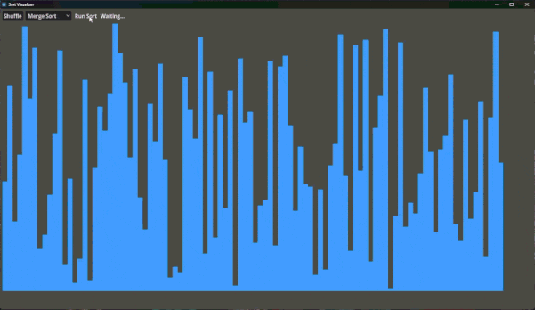

# Sort Visualizer

ソートアルゴリズムを可視化するツールです。
Godot の練習目的で作ったものなので、アルゴリズムやパフォーマンスについてはあまり厳密ではありません。

## 実装アルゴリズム

1. バブルソート
1. マージソート
1. 挿入ソート
1. 選択ソート
1. シェルソート
1. ヒープソート
1. クイックソート
1. 鳩の巣ソート
1. 基数ソート
1. バケットソート
1. ノームソート
1. シェーカーソート
1. コムソート

## インストール

1. [Releases](https://github.com/jiro4989/sort_visualizer/releases) から Assets をダウンロードする
1. 圧縮ファイルを解凍する
1. 実行可能ファイルを実行する

## アンインストール

1. 実行可能ファイルごとフォルダを削除する

## 使い方

1. ツールを起動する
1. （値を変更したければ）Shuffle を押す
1. ソートアルゴリズムを選択する
1. Run を押す
1. 完了するまで待つ

## ライセンス

MIT